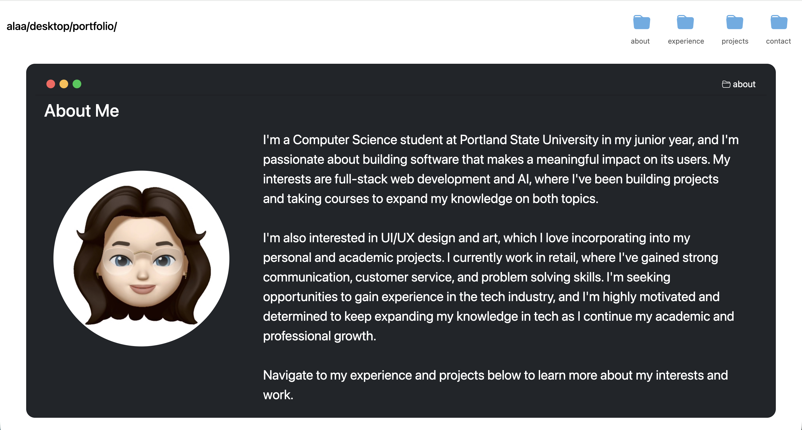

# Portfolio Website

This repository contains my terminal-inspired portfolio website. It features an About Me, Experience, Projects, and Contact Me sections, and a loading-screen on your first visit. I used the EmailJS API to get emails from whoever decides to send one, and the localStorage API to make sure you don't see the loading screen more than once.



## Description

This website was built using HTML, CSS, JavaScript, and Bootstrap. It was inspired by the MacOS terminal and folder structure, and showcases my academic and professional experience and projects, as well as my interest in UI/UX design.

## Features

- Responsive design using Bootstrap and media queries
- Terminal and MacOS desktop inspired theme
- Contact form implemented with EmailJS
- Loading screen shown on the first visit using localStorage

## Getting Started

### Tech Stack

- HTML
- CSS
- JavaScript
- Bootstrap v5.3
- Bootstrap icons v1.13.1
- EmailJS

### Installing

```
git clone https://github.com/Aayyach/alaa-ayyach
cd alaa-ayyach
```

### Running the Website

If you're using **VSCode** have the **Live Server** extension:

- Press Go Live on the bottom right-hand corner of your VSCode window.

Otherwise:

- Open the index.html file in your browser

### Live Website

https://aayyach.github.io/alaa-ayyach

## Authors

[@Aayyach](https://github.com/Aayyach)

## Acknowledgements

These sources were used to aid in the development process:

- [Bootstrap Documentation](https://getbootstrap.com/docs/5.3/getting-started/introduction/)
- [Bootstrap Navbar With Icons](https://www.youtube.com/watch?v=go7d3TXVt-4&feature=youtu.be)
- [Bootstrap 5 Navbar Align to Right](https://www.youtube.com/watch?v=IwXk90FHhM8&feature=youtu.be)
- [Text under icons](https://stackoverflow.com/questions/65254818/add-text-to-icon-in-bootstrap-5-navbar)
- [How To Get Images Adjacent To Text](https://forum.freecodecamp.org/t/how-to-get-images-to-sit-adjacent-to-text/498977)
- [Right-Align Flex Item](https://stackoverflow.com/questions/22429003/how-to-right-align-flex-item)
- [CSS Circle() Function](google.com/url?q=https://www.w3schools.com/cssref/func_circle.php&sa=D&source=docs&ust=1781060464972528&usg=AOvVaw3NNWnILr5lyY9yDBzaptA1)
- [Bootstrap Media Queries](https://www.youtube.com/watch?v=GJRd1yRGFuA&feature=youtu.be)
- [Moving Images Upwards](https://stackoverflow.com/questions/40797433/how-to-move-an-image-upwards-in-html-css)
- [Bootstrap Accordion Color Change](https://www.youtube.com/watch?v=mm_7-6-GxYQ)
- [Bootstrap Accordion Icon Color Change](https://stackoverflow.com/questions/66335238/changing-the-color-arrow-in-bootstrap)
- [Sending Emails With EmailJS](https://www.youtube.com/watch?v=BgVjild0C9A)
- [EmailJS Installation](https://www.emailjs.com/docs/sdk/installation/)
- [Button Event Listeners](https://stackoverflow.com/questions/2788191/how-to-check-whether-a-button-is-clicked-by-using-javascript)
- [DOM Events](https://developer.mozilla.org/en-US/docs/Web/API/Document_Object_Model/Events)
- [Form Validation with JavaScript](https://www.youtube.com/watch?v=kPP445LM2lE)
- [Calling Bootstrap Modal with JavaScript](https://www.youtube.com/watch?v=XUhdzIO6lgg)
- [Making a Loading Screen in CSS and JS](https://www.youtube.com/watch?v=2o84lQQVq2E)
- [Loading Screen for First-Time Visitors](https://www.youtube.com/watch?v=OSB_f7KS-9Y)
